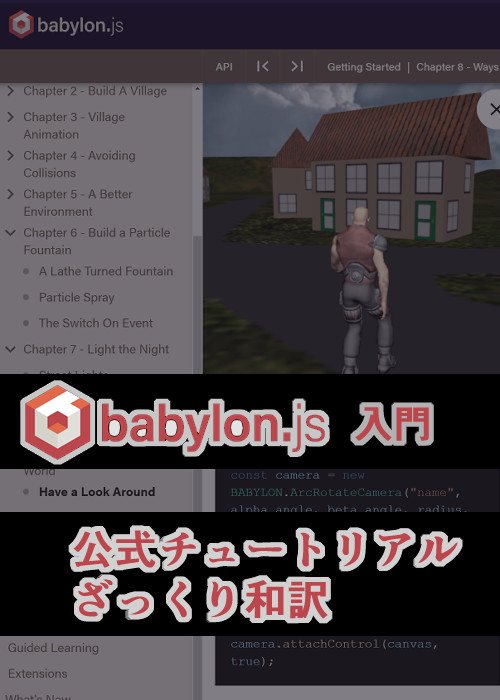

# お役立ちリンク集

ここでは、 Babylon.js での開発の際に使える様々なサイトを紹介しています。

## 公式ページ一覧

- [Babylon.js: Powerful, Beautiful, Simple, Open - Web-Based 3D At Its Best](https://www.babylonjs.com/): 公式ページです
- [Home | Babylon.js Documentation](https://doc.babylonjs.com/): 公式ドキュメントです
- [Forum](https://forum.babylonjs.com/): 公式コミュニティフォーラムです
- [Babylon.js – Medium](https://babylonjs.medium.com/): 公式ブログです
- [Babylon.js Playground](https://playground.babylonjs.com/): プレイグラウンドです
- [BabylonJS/Babylon.js: Babylon.js is a powerful, beautiful, simple, and open game and rendering engine packed into a friendly JavaScript framework.](https://github.com/BabylonJS/Babylon.js): GitHub ソースコードです
- [Babylon.js Sandbox - View glTF, glb, obj and babylon files](https://sandbox.babylonjs.com/): モデルビューアです
- [Babylon.js Node Material Editor](https://nme.babylonjs.com/): ノードマテリアルエディタです
- [Babylon js - YouTube](https://www.youtube.com/@BabylonJSEngine): 公式 YouTube チャンネルです
- [Babylon.js（@babylonjs）さん / X](https://x.com/babylonjs?lang=ja): 公式 X アカウントです

## Babylon.js 公式入門チュートリアルざっくり和訳 - Zenn

> Web ブラウザ上で(も) 3D モデルを作ったり動かせたりする JavaScript の WebGL ライブラリ Babylon.js (バビロン ジェイ エス) の公式入門チュートリアルをざっくり和訳しました。(2022/5/01 時点で第 5 章まで。逐一 残りも公開していきます)
>
> 著: ちょまどさん

## その他

- [Babylon.js JAPAN - connpass](https://babylonjs.connpass.com/): 日本コミュニティ connpass です
- [Babylon.jsの記事一覧 | Zenn](https://zenn.dev/topics/babylonjs): Zenn の記事一覧です
- [Babylon.js Tips集](https://scrapbox.io/babylonjs/): 日本コミュニティ公式 Tips 集です
- [Windows Mixed Reality での WebXR の使用 - Mixed Reality | Microsoft Learn](https://learn.microsoft.com/ja-jp/windows/mixed-reality/develop/javascript/webxr-overview): Microsoft の WebXR 開発チュートリアルです
- [Babylon.js を使った基本的なデモの作成 - ゲーム開発 | MDN](https://developer.mozilla.org/ja/docs/Games/Techniques/3D_on_the_web/Building_up_a_basic_demo_with_Babylon.js): MDN の 3D ゲームデモです
- [Babylon.jsレシピ集 | インプレス NextPublishing](https://nextpublishing.jp/book/16386.html): 日本コミュニティ本vol.1です
- [Babylon.js レシピ集 Vol.2 | インプレス NextPublishing](https://nextpublishing.jp/book/17146.html): 日本コミュニティ本vol.2です
- [Babylon.js レシピ集 Vol.3 | インプレス NextPublishing](https://nextpublishing.jp/book/17662.html): 日本コミュニティ本vol.3です
